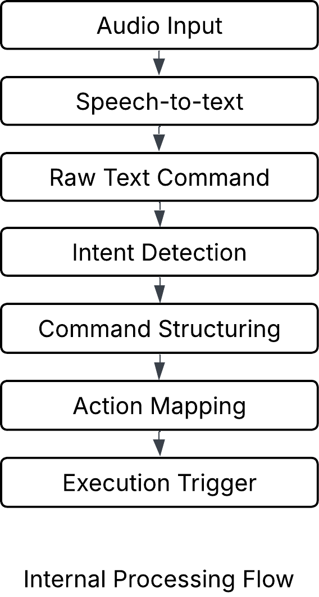
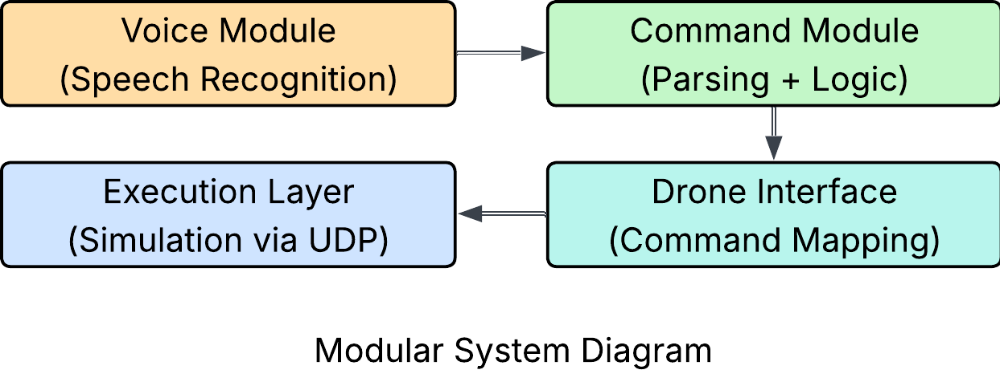
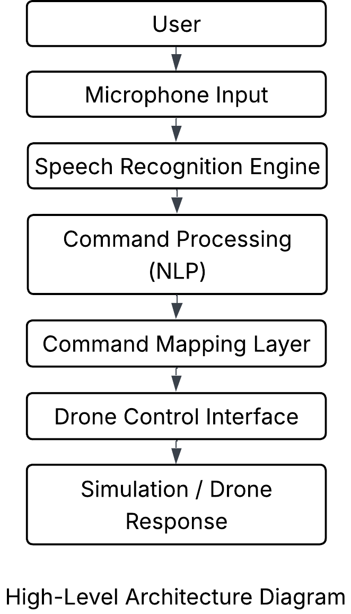

# Voice-Controlled Drone Assistant (MAVLink / ArduPilot)

## Overview

This project implements a voice- and text-driven drone control assistant for ArduPilot-based UAVs using MAVLink.

The system is designed as a safety-first control interface that processes user commands and validates them against real-time telemetry before execution. It supports simulation using ArduPilot SITL and is structured for future integration with real UAV systems.

---

## System Architecture

```text
User Command (Voice / Text)
        ↓
Assistant Interface
        ↓
Command Dispatcher
        ↓
Safety Gate (Telemetry Validation)
        ↓
MAVLink Command Sender
        ↓
ArduPilot (SITL / Real Vehicle)

Parallel Process:
Telemetry Listener → Shared Telemetry State
```

---

## System Diagrams

### Architecture

<p align="center">
  
</p>

### Data Flow

<p align="center">
  
</p>

### Module Structure

<p align="center">
  
</p>

---

## Project Structure

```text
src/
├── assistant.py
├── command_dispatcher.py
├── safety_gate.py
├── telemetry_state.py
├── mavlink_connection.py
```

---

## How It Works

* A background telemetry process continuously updates vehicle state
* User commands are received (text now, voice extendable)
* Commands are routed through a central dispatcher
* A safety gate validates each command using telemetry
* Only safe commands are transmitted via MAVLink

---

## Example Commands

```text
set mode guided
takeoff
land
go forward
go left
rotate right
```

---

## Features

* MAVLink communication using pymavlink
* ArduPilot SITL integration
* Real-time telemetry monitoring
* Safety-gated command execution
* Centralized command dispatcher
* Modular system design

---

## Safety Model

* Commands execute only in valid flight modes (GUIDED)
* No implicit arming or unsafe actions
* All commands pass through a centralized safety validation layer

---

## Running the System (Simulation)

### 1. Clone Repository

```bash
git clone https://github.com/ARYAN13520/voice-drone-assistant.git
cd voice-drone-assistant
```

### 2. Setup Environment

```bash
python3 -m venv .voice-venv
source .voice-venv/bin/activate
pip install pymavlink
```

### 3. Start ArduPilot SITL

```bash
sim_vehicle.py -v ArduCopter --console --map --out=udp:127.0.0.1:14550
```

### 4. Run Assistant

```bash
python -m src.assistant
```

---

## Limitations

* Simulation-focused implementation
* Limited command vocabulary
* No hardware failsafe integration

---

## Future Work

* Voice input integration (speech-to-text)
* PX4 / MAVLink expansion
* Telemetry visualization
* Companion computer deployment

---

## Author

Aryan Hajare
